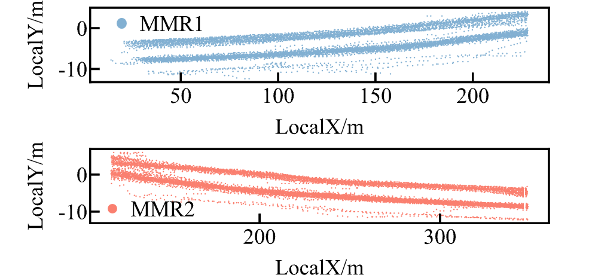
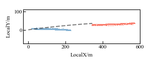

# data list

Trajectory data from radar data：

1. radar1data.xlsx 

2. radar2data.xlsx

3. roadgeometry.csv

   A scatter plot of the trajectories of the data is shown below

​	The initial values of the trajectory data in road conditions are as follows

